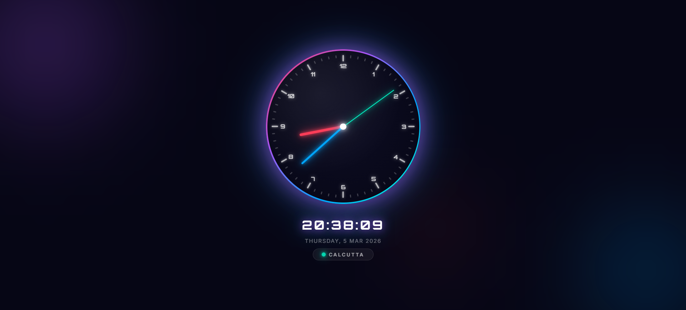

# Analog Clock

A beautiful, minimal analog clock built with pure **HTML**, **CSS**, and **JavaScript** — no libraries or frameworks required. Features a glowing neon aesthetic with ambient background orbs, smooth hand animations, a live digital readout, and real-time geolocation-based city display.



---

## Features

- **Analog clock face** with 60 dynamically generated tick marks (major marks every 5 minutes)
- **Three glowing hands** — hour (red), minute (blue), second (teal/cyan)
- **Smooth rotation** — hands update every second with precise degree calculations
- **Digital time display** below the clock in the Orbitron monospace font
- **Live date** — shows full day name, date, abbreviated month, and year
- **Geolocation badge** — detects your city and country via the browser's Geolocation API and reverse geocoding; falls back to the system timezone if permission is denied
- **Animated glow ring** — gradient outer ring that pulses with a slow glow animation
- **Ambient background orbs** — three blurred radial-gradient orbs create a subtle depth effect
- **Pulsing live dot** — glowing teal indicator in the location badge
- **SEO + Open Graph meta tags** — page is shareable and crawlable
- **Emoji favicon** — no extra image file needed
- **Vercel-ready** — ships with a `vercel.json` for zero-config static deployment

---

## Tech Stack

| Layer      | Technology |
|------------|------------|
| Markup     | HTML5 |
| Styling    | CSS3 (custom properties, keyframe animations, `backdrop-filter`) |
| Logic      | Vanilla JavaScript (ES2020+) |
| Fonts      | [Orbitron](https://fonts.google.com/specimen/Orbitron) & [Inter](https://fonts.google.com/specimen/Inter) via Google Fonts |
| Geocoding  | [BigDataCloud Reverse Geocode API](https://www.bigdatacloud.com/free-api/free-reverse-geocode-to-city-api) (free, no API key needed) |
| Hosting    | [Vercel](https://vercel.com) (static) |

---

## Project Structure

```
CLOCK/
├── index.html      # Markup — clock skeleton, hand elements, info panel
├── styles.css      # All visual styling, animations, and layout
├── script.js       # Clock logic, tick generation, geolocation
├── vercel.json     # Vercel static deployment config
└── README.md
```

---

## How It Works

### Clock Hands
Each hand is a CSS-custom-property–driven `<div>` styled with `--clr`, `--h` (height), and `--w` (width). JavaScript rotates them every second:

```js
hour.style.transform = `rotate(${30 * hh + mm / 2}deg)`;  // 360° / 12h
min.style.transform  = `rotate(${6  * mm}deg)`;            // 360° / 60min
sec.style.transform  = `rotate(${6  * ss}deg)`;            // 360° / 60sec
```

### Tick Marks
60 `<div>` elements are generated at runtime. Every 5th tick is a "major" mark (taller, brighter); the rest are "minor".

### Geolocation
1. Requests the browser's Geolocation API.
2. On success, calls the BigDataCloud reverse geocoding endpoint with the coordinates.
3. Displays `City, Country` in the badge (e.g. `Mumbai, India`).
4. Falls back to the IANA timezone name (e.g. `Asia/Kolkata` → `Kolkata`) if permission is denied or the API fails.

---

## Getting Started

### Run Locally
No build step needed — just open the file directly in a browser:

```bash
git clone https://github.com/your-username/clock.git
cd clock
# Open index.html in your browser
start index.html        # Windows
open  index.html        # macOS
xdg-open index.html     # Linux
```

> **Note:** Geolocation requires a secure context (`https://` or `localhost`). If you open the file via `file://`, the location badge will fall back to the timezone name.

### Deploy to Vercel
```bash
npm i -g vercel
vercel
```
Or connect the repository to [vercel.com](https://vercel.com) for automatic deployments on every push.

---

## Customisation

| What to change | Where |
|----------------|-------|
| Hand colours | `--clr` inline styles in `index.html` |
| Hand lengths / widths | `--h` and `--w` inline styles in `index.html` |
| Glow ring gradient | `.clock-ring` background in `styles.css` |
| Background orb colours | `.orb-1 / .orb-2 / .orb-3` in `styles.css` |
| Pulse speed | `@keyframes pulseDot` duration in `styles.css` |
| Glow animation speed | `@keyframes glowPulse` duration in `styles.css` |

---

## Browser Support

Works in all modern browsers that support CSS custom properties, `backdrop-filter`, and the Geolocation API (Chrome, Edge, Firefox, Safari).

---

## License

MIT — free to use, modify, and distribute.

---

## Author

**Vaibhav Chauhan**